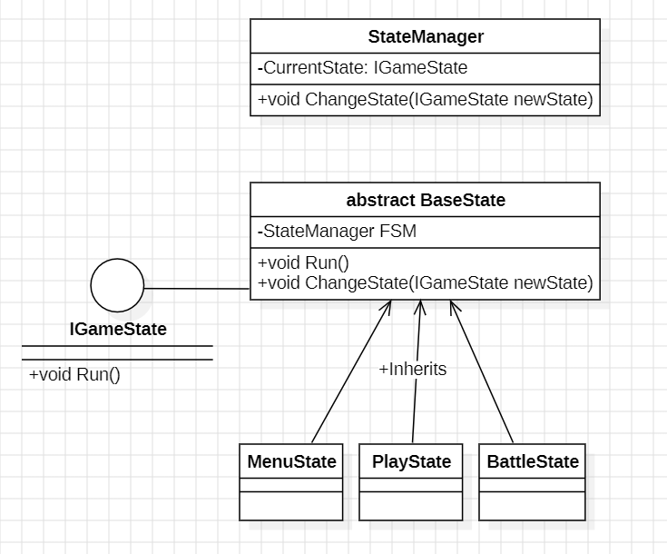

# Wolf-Hide

### Table of Contents

| Section | Description |
|---------|-------------|
| 1.0 | Origin          |
| 1.1 | Genre           |
| 1.2 | Concept         |
| 1.3 | Gameplay        |
| 1.4 | Characters      |
| 1.5 | Story           |
| 1.6 | Software Architecture |
| 1.7 | Strengths & Limitations |

### 1.0 Origin

**Wolf-Hide**
*Noun*

In the Poetic Edda, one of the earliest works of Norse mythology, *the saga of the Völsungs* details the plight of the Völsung clan. 

This includes a passage where Sigmund and his nephew Sinfjǫtli don the hides of wolves. Like Berserkers (literally, bear-skins), they combine with the spirit of the animals, transforming into vicious beasts.

This supernatural aspect of the tale is dropped shortly after, but it's established that the family of King Siggeir, responsible for King Volsung's death, are also capable of transformation.

A Norse RPG world inhabited by bear-skins and wolf-hides has never been explored; their quick speeds and overwhelming strength making for a world where the under-powered protagonist of the horror RPG and skill-tree based fantasy RPG elements can merge.

### 1.1 Genre

The genre is a story-driven RPG. The teenage protagonist Sinfjǫtli is initially underpowered, with a simple bow and arrow, but as we follow the story beats, he matures; We also play as his uncle Sigmund, who thrives in melee combat, and his mother Signy, who uses magic. The USP of the game is the implementation of the battle system. 

### 1.2 Core Concept

Entirely 2D, the overhead map transitions to a front-on, timing-based battle system. 

Encounters are not random, as in Final Fantasy, with fast-paced, real-time combat based on the charge up, swing, and release of various weapons. 

Time it perfectly and the enemy is staggered, too late and you are instead. 

### 1.3 Gameplay

Different weapons have different charge up times and effects, lending themselves to different playstyles.

You can spam dagger attacks, effective against hoardes of unarmoured enemies, but with little knock back, this becomes less effective against more powerful foes. Like other light-weight slash weapons, stacks well with poison.

Axes and hammers have more wind up, but with much greater stagger as pay off. Particularly effective at disrupting power attacks.

Bow and arrow is effective at a distance, stacks well with poison, or flames, but quick drawing takes constant practice. Heavy bows have a chance to stagger.

Greatswords are the weapons of choice used by Sigmund. Spells and posion that of Queen Signy.

But with limited skill points, and less money and favour, which weapons will and abilities will you choose to develop?

### 1.4 Characters

Playable Characters:

**Sinfjǫtli**, a teenage boy,
**Sigmund**, uncle of Sinfjǫtli,
**Queen Signy**, Sinfjǫtli's mother, wife of King Siggeir,

Non-Playable Characters:

**Olaf**, a lord,
**Halstein**, a lord,
**Sven**, a soldier and drunkard,
**Skald Jorver**, the poet,
**Einar**, protector of the King, 
**Torben**, protector of the King, brother of Torben,
**Wanderer**, seeking refuge,
**Thurman**, counsellor to the King,
**Knut**, a farmer, the oldest brother,
**Otter**, a farmer, the middle brother,
**Offal**, a farmer, the youngest brother,

### 1.5 Story

Although working in software, my degree was in creative writing, speficially writing and directing theatre. Most of my performed plays were dark comedies,  and this element has crept into the story slightly, in a limited fashion.

The story beats are loosely inspired by the great *Saga of the Volsungs*, but artitistic liberties have been taken, primarily for the sake of expanding the tale as gamified story.

Although I love storytelling, and my main aim was to create a fun, story-driven game, I am also aware that some people will skip through scenes expanding on the worldbuilding. 

Dialogue *is* character, and there are thousands of lines of dialogue between the many characters, many of these optional, and this will be skippable; major scenes will have the option to save immediately afterwards to avoid hearing the same lines over and over again.

### 1.6 Software Architecture

**Overview**

I plan to create my own game engine for this specific combat style: partly to ensure I have full autonomy, partly to increase my familiarity with C#. 

As a side note, my previous games implemented in Python with a low level graphics framework called PyGame, rather than a bells-and-whistles engine like Unity, so I intend to design my own physics, collision detection, etc.

This game will be designed with the graphics framework MonoGame. For the sake of learning, I also plan to write many of the same elements in Rust, although it's unlikely this version will be in the final game.

**gameStateMachine**

### 1.7 Strengths & Limitations

I have spent multiple years thinking about this particular story, what medium it should take, how best to adapt it. My initial plan was a short story, then a film script, I even planned a novel; but finally, as the ideas coalesced, the form which best fit the content became apparent.

Note: I am not an artist. I have never claimed to be, and after doing some 2D sprite design for an earlier game written in Python, I would say that my art will be placeholder at best. In some ways, this may oddly be an advantage. 

Art is incredibly time consuming. And I know my strengths lie more in programming and storytelling. If I can get my game to feel fun with placeholder art, I'd love to bring in an artist later.

